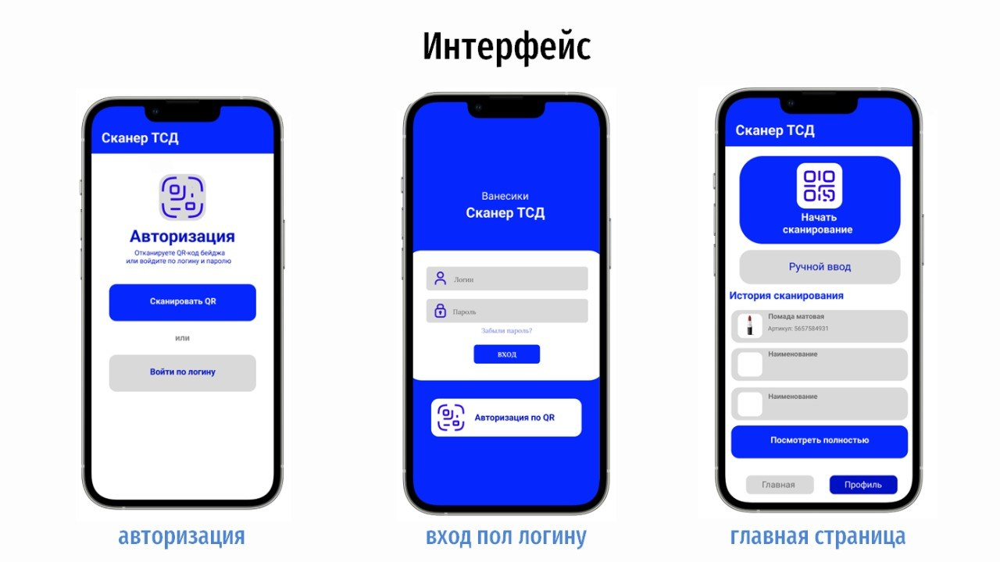
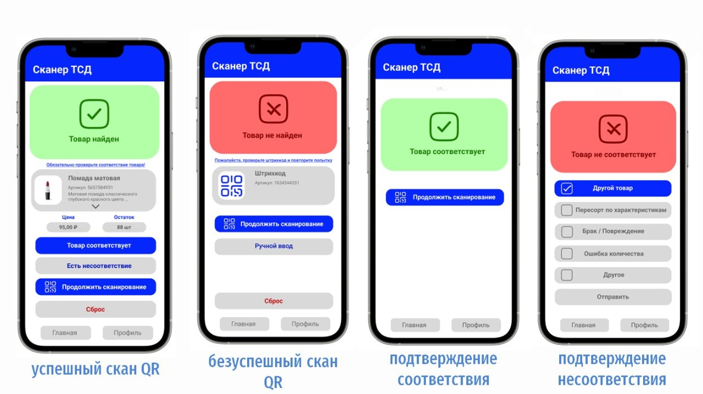
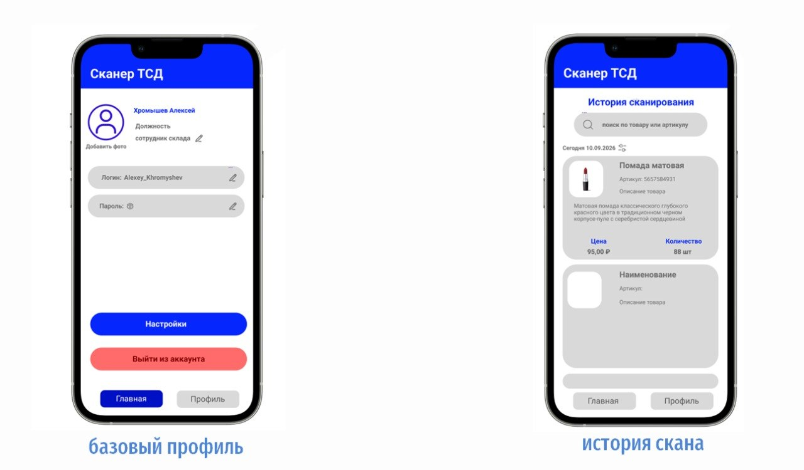
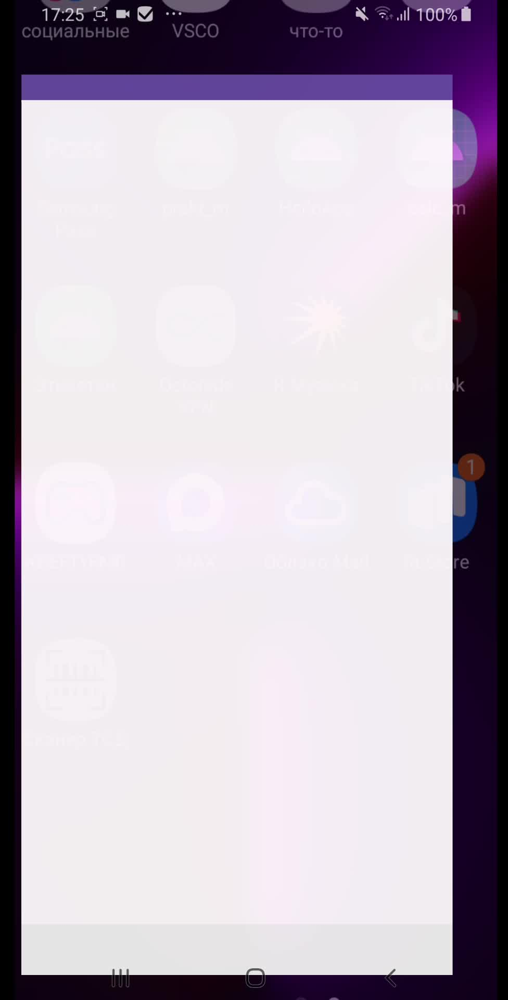
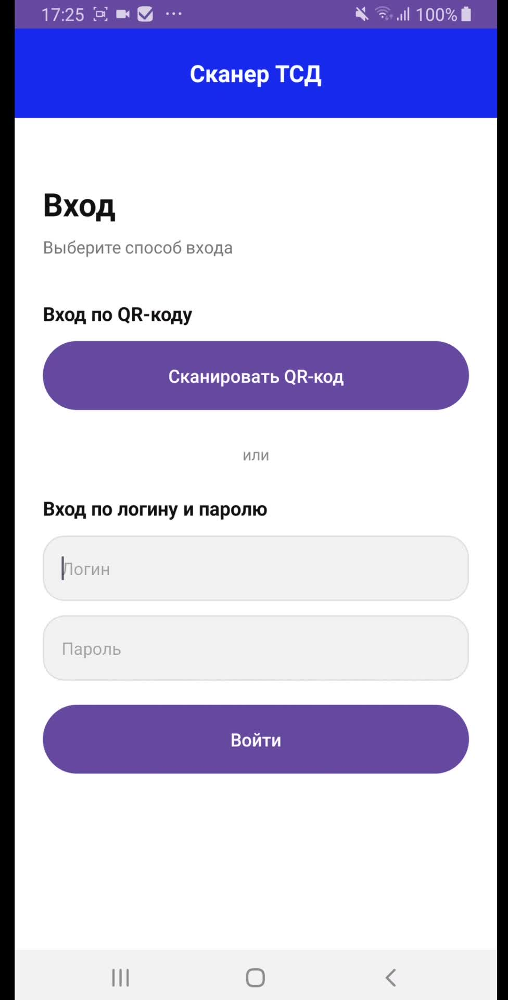
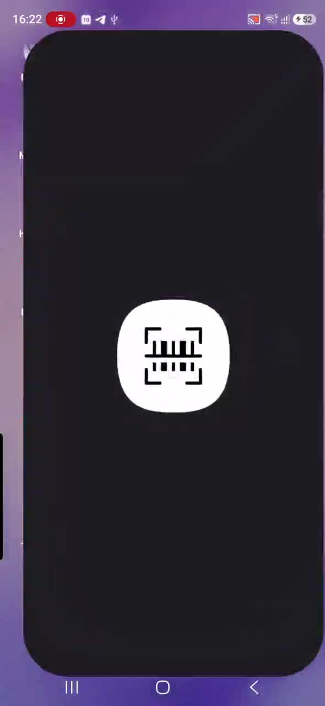
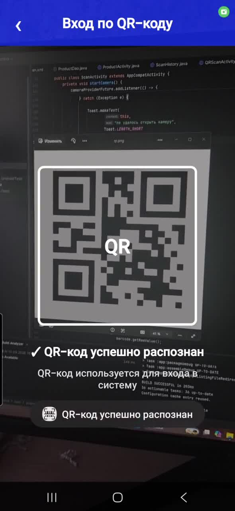
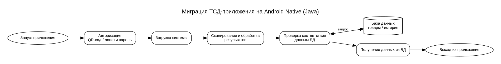
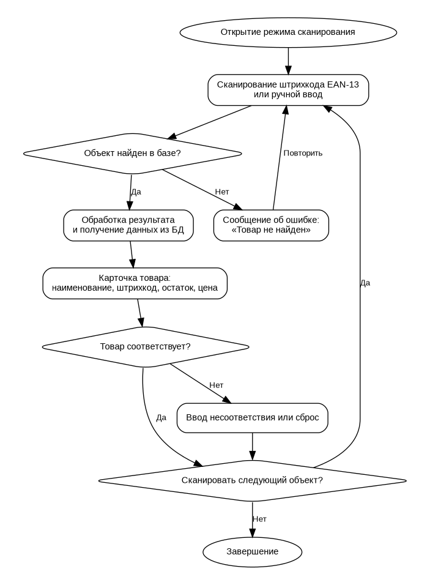

# Сканер ТСД — Android Native Java

Учебный командный проект по миграции приложения для терминала сбора данных (ТСД) на **Android Native / Java**. Проект выполнялся командой из пяти человек. Цель работы — создать мобильное приложение для авторизации сотрудника, сканирования штрихкодов и QR-кодов, поиска товара в локальной базе данных и отображения информации о найденном товаре.

Проект находится в стадии **MVP / прототипа**. Основные экраны, навигация, локальная база данных и часть сценариев сканирования уже реализованы. В дальнейшем команда хотела бы довести проект до полноценной законченной версии: завершить бизнес-логику сканирования, подключить полноценную серверную часть и рабочую базу данных, реализовать обработку несоответствий, профиль сотрудника, синхронизацию истории и подготовить приложение к реальному использованию на ТСД-устройствах.

## Что реализовано

- экран авторизации по логину и паролю;
- отдельный сценарий авторизации по QR-коду;
- главное меню приложения;
- сканирование QR-кодов и штрихкодов через камеру;
- ручной ввод штрихкода;
- локальная база данных Room;
- поиск товара по штрихкоду;
- карточка товара с ценой и остатком;
- сохранение истории найденных товаров;
- прототип интерфейса и пользовательского сценария.

## Технологии

- Java 11;
- Android Native;
- AndroidX;
- CameraX;
- Google ML Kit Barcode Scanning;
- ZXing Core;
- Room Database;
- XML Layouts;
- Gradle Kotlin DSL.

Минимальная версия Android: **API 24**.

## Дизайн интерфейса

Дизайн приложения был предварительно подготовлен в Figma. Ниже приведены макеты, использованные как основа для Android-интерфейса.

### Экран авторизации



### Главное меню



### Карточка товара / рабочие экраны



## Результат реализации

Ниже — реальные кадры из демонстрации работающего Android-приложения.

<table>
<tr>
<td></td>
<td></td>
</tr>
<tr>
<td></td>
<td></td>
</tr>
</table>

## Демонстрация

GitHub не всегда воспроизводит локальный MP4 непосредственно внутри Markdown, поэтому видео сохранены в репозитории и доступны по ссылкам:

- [Демонстрация приложения №1](docs/videos/demo-01.mp4)
- [Демонстрация приложения №2](docs/videos/demo-02.mp4)

## Диаграммы

### Общая схема процесса



Исходник для редактирования: [bpmn.drawio](docs/diagrams/bpmn.drawio)

### Процесс сканирования



Исходник для редактирования: [scan-flow.drawio](docs/diagrams/scan-flow.drawio)

## Архитектура проекта

```text
app/src/main/
├── java/com/example/myapplication/
│   ├── AppDatabase.java
│   ├── LoginActivity.java
│   ├── MainActivity.java
│   ├── Product.java
│   ├── ProductActivity.java
│   ├── ProductDao.java
│   ├── QRScanActivity.java
│   ├── RegistrationActivity.java
│   ├── ScanActivity.java
│   └── ScanHistory.java
├── res/
│   ├── drawable/
│   ├── layout/
│   ├── mipmap-*/
│   └── values/
└── AndroidManifest.xml
```

Документация и материалы проекта находятся в папке `docs/`.

## Локальная база данных

Для хранения данных используется **Room**. В текущем прототипе при первом создании базы добавляются два тестовых товара:

| Штрихкод | Товар | Цена | Количество |
|---|---|---:|---:|
| `001` | Помада матовая стойкая | 1250 | 88 |
| `002` | Тушь для ресниц объемная | 890 | 45 |

Эти значения можно использовать для проверки ручного поиска товара.

## Текущий статус

Проект является рабочим учебным прототипом, а не полностью завершённым промышленным продуктом. На текущем этапе уже создан интерфейс, настроена навигация, реализована локальная база данных, история и распознавание кодов камерой.

Часть сценариев ещё требует доработки. В частности, поток камерного сканирования необходимо полностью связать с поиском товара в Room и общей логикой карточки товара. Также прототип авторизации пока не подключён к реальной базе сотрудников.

## Дальнейшее развитие

В дальнейшем мы хотели бы закончить проект до полноценной версии. Основные направления развития:

1. полностью объединить распознавание штрихкода камерой с поиском товара в базе данных;
2. реализовать полноценную авторизацию сотрудников;
3. подключить backend/API и серверную базу данных;
4. синхронизировать остатки и данные о товарах;
5. реализовать фиксацию несоответствий товара;
6. расширить историю сканирования и добавить фильтрацию;
7. реализовать профиль пользователя и выход из аккаунта;
8. добавить обработку сетевых ошибок и офлайн-режим;
9. провести полноценное тестирование на реальном ТСД-оборудовании;
10. улучшить интерфейс и максимально приблизить итоговое приложение к подготовленному Figma-дизайну;
11. подготовить release-сборку и документацию для установки.

Таким образом, текущая версия демонстрирует основную идею и техническую основу приложения, которую можно дальше развивать до полноценного решения для работы со складскими товарами и терминалами сбора данных.

## Документация

- [Техническое задание](docs/documents/technical-specification.docx)
- [Презентация проекта](docs/documents/presentation.pdf)

## Как запустить

1. Установить Android Studio.
2. Клонировать или скачать репозиторий.
3. Открыть корневую папку проекта в Android Studio.
4. Дождаться завершения Gradle Sync.
5. Запустить приложение на Android-устройстве или эмуляторе с API 24+.
6. Для сканирования предоставить приложению доступ к камере.

Через терминал debug APK можно собрать командой:

```bash
./gradlew assembleDebug
```

На Windows:

```powershell
.\gradlew.bat assembleDebug
```

Готовый APK после сборки будет находиться в:

```text
app/build/outputs/apk/debug/app-debug.apk
```

## Структура репозитория

```text
.
├── app/                       # Android-приложение
├── docs/
│   ├── diagrams/              # PNG + исходники Draw.io
│   ├── documents/             # ТЗ и презентация
│   ├── images/
│   │   ├── figma/             # дизайн из Figma
│   │   └── result/            # кадры из работающего приложения
│   └── videos/                # демонстрационные видео
├── gradle/
├── build.gradle.kts
├── settings.gradle.kts
├── gradlew
├── gradlew.bat
└── README.md
```

## Команда

Проект выполнен командой из **5 человек** в рамках совместной разработки и миграции ТСД-приложения на Android Native Java.
